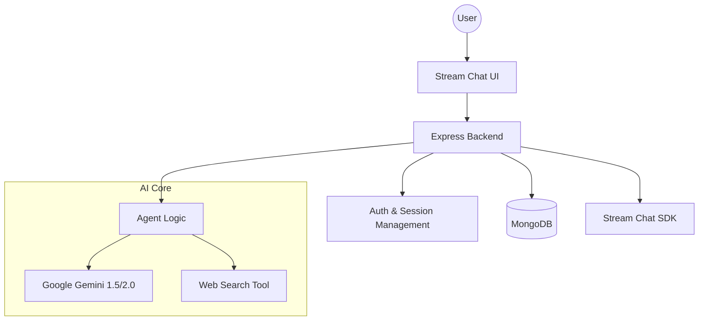

# Promptly 🚀

Promptly is a state-of-the-art AI-powered chat platform that combines real-time messaging with advanced agentic AI capabilities. Built with scalability and user experience in mind, it features a seamless integration between Stream Chat, Google Gemini, and MongoDB.

## ✨ Features

- **Real-time Chat**: Powered by Stream Chat for instant, reliable messaging.
- **Agentic AI**: Integrated AI Assistant using Google Gemini 2.0 for content generation and complex task handling.
- **Smart Search**: Real-time web search capabilities using Tavily API.
- **User Persistence**: MongoDB-backed user profiles and session tracking.
- **Beautiful UI**: Modern, glassmorphic design system using Tailwind CSS and Lucide icons.
- **Dynamic Channels**: Create and manage messaging channels on the fly.

## 🛠️ Technology Stack

### Frontend

- **React 18** + **Vite**
- **TypeScript**
- **Tailwind CSS** (Styling)
- **Stream Chat React SDK** (Messaging UI)
- **Lucide React** (Icons)
- **Shadcn UI** (Component primitives)

### Backend

- **Node.js** + **Express**
- **TypeScript**
- **MongoDB** + **Mongoose** (Data persistence)
- **Stream Chat SDK** (Backend messaging & Auth)
- **Google Generative AI** (Gemini API)
- **Tavily SDK** (Real-time Search)

---

## 🤖 Agent Architecture

Promptly uses a modular agent architecture to bridge the gap between user intent and AI action:



### Key Components:

- **Stream Chat Engine**: Handles the real-time websocket connections and message history.
- **Gemini Orchestrator**: Manages prompts and interprets user requests for high-performance AI generation.
- **Interaction Tracker**: Syncs user engagement metrics (sessions/channels) between Stream and MongoDB.

---

## 🚀 Getting Started

### Prerequisites

- **Node.js** (v18+)
- **NPM** or **Yarn**
- **MongoDB** (Local instance or Atlas)
- **API Keys**:
  - Stream Chat (API Key & Secret)
  - Google Gemini API Key
  - Tavily API Key

### Installation

1. **Clone the repository**:

   ```bash
   git clone https://github.com/Shreyas-J-U/Promptly.git
   cd Promptly
   ```

2. **Setup Server**:

   ```bash
   cd server
   npm install
   # Create a .env file based on .env.example
   npm run dev
   ```

3. **Setup Client**:
   ```bash
   cd ../client
   npm install
   # Create a .env file based on .env.example
   npm run dev
   ```

---

## 🛠️ Tools & Technologies Used

- **Mongoose**: For structured MongoDB schema modeling.
- **Express SDK**: For robust RESTful API endpoints.
- **Stream-Chat-React**: For high-performance chat components.
- **Freyer Motion**: (Optional) For smooth UI transitions.

---

## 📝 License

This project is licensed under the MIT License.

## 👤 Author

**Shreyas J U**

- GitHub: [@Shreyas-J-U](https://github.com/Shreyas-J-U)
