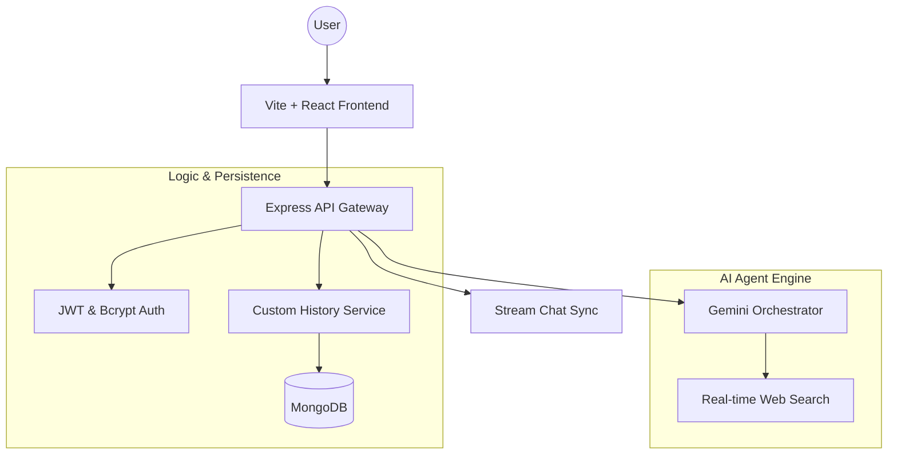

# Promptly 🚀

**Promptly** is a premium, AI-native workspace designed for high-performance content generation and research. It transforms the traditional chat experience into an agentic workflow, combining real-time web search, deep response insights, and a seamless developer-first interface.

---

## ✨ Core Capabilities & Specialties

### 🤖 Intelligence Engine

- **Next-Gen Gemini Integration**: Powered by Google Gemini models for human-like creative writing, robust coding assistance, and advanced reasoning.
- **Deep Discovery (Search)**: Integrated **Tavily AI** orchestrator for real-time web crawling, providing cited sources and validated truths.
- **Neural Analysis Feed**: Every response is accompanied by a metadata workspace:
  - 🔗 **Resource Trace**: Clickable citations for transparent research.
  - 🌐 **Intelligence Mapping**: Domain breakdown of information origin nodes.
  - ⏱️ **Latency Metrics**: High-precision generation speed tracking.
  - 🧠 **Contextual Highlights**: Automated extraction of critical takeaways for rapid consumption.

### 🎨 State-of-the-Art Interface

- **Premium Glassmorphism**: A stunning, translucent UI architecture built with advanced backdrop blurs and subtle satin borders.
- **Dynamic Fluid Motion**: Powered by **Framer Motion** for smooth, physics-based transitions and micro-animations that make the UI feel "alive".
- **Responsive Architecture**: A custom-engineered mobile-first layout with intelligent drawer systems and adaptive sidebar logic.
- **Modern Typography**: Featuring the **Outfit** font family for a sleek, high-end editorial aesthetic.

### 🛡️ Secure Workspace

- **Custom Persistence Node**: Proprietary history engine that stores interactions securely in a dedicated MongoDB layer.
- **Identity Protection**: Robust JWT session management paired with salted Bcrypt password rounds.
- **One-Click Reset**: Instant state hydration and workspace clearing for rapid iteration.

---

## 🛠️ Technology Stack

| Layer        | Technologies                                                              |
| :----------- | :------------------------------------------------------------------------ |
| **Frontend** | React 18, Vite, TypeScript, Tailwind CSS, **Framer Motion**, Lucide Icons |
| **Backend**  | Node.js, Express, TypeScript, MongoDB (Mongoose)                          |
| **AI Core**  | Google Generative AI (Gemini), Tavily Search SDK                          |
| **Security** | JWT, Bcrypt, Dotenv-Vault                                                 |
| **Realtime** | Stream Chat SDK (Session Management Logic)                                |

---

## 🧬 System Architecture



---

## 🚀 Quick Start

### 1. Environment Configuration

Create a `.env` file in both `/client` and `/server` directories:

**Server `.env`:**

```env
PORT=3000
MONGODB_URI=your_mongodb_uri
STREAM_API_KEY=your_key
STREAM_API_SECRET=your_secret
GEMINI_API_KEY=your_gemini_key
TAVILY_API_KEY=your_tavily_key
JWT_SECRET=your_secure_random_string
```

**Client `.env`:**

```env
VITE_STREAM_API_KEY=your_key
VITE_API_URL=http://localhost:3000
```

### 2. Installation & Launch

```bash
# Clone the vault
git clone https://github.com/Shreyas-J-U/Promptly.git
cd Promptly

# Launch the Engine (Server)
cd server
npm install
npm run dev

# Launch the Interface (Client)
cd ../client
npm install
npm run dev
```

---

## 👤 Author

**Shreyas J U**  
_Building the future of agentic interfaces._

[](https://github.com/Shreyas-J-U)
[](https://shreyas-portfolio-ten.vercel.app/)

---

> [!TIP]
> Use the **Web Search** toggle in the assistant panel to enable real-time information retrieval for your prompts!
