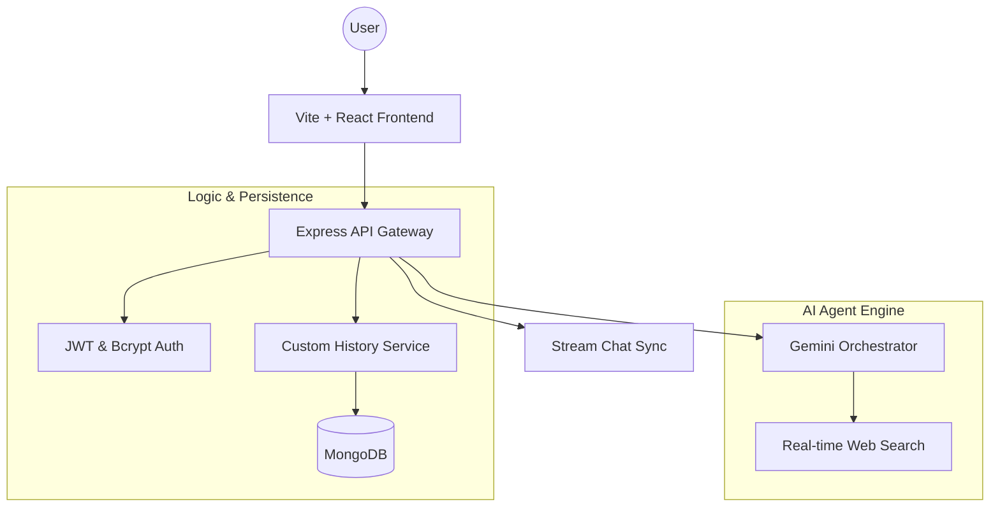

# Promptly 🚀

**Promptly** is a premium, AI-native workspace designed for high-performance content generation and research. It transforms the traditional chat experience into an agentic workflow, combining real-time web search, deep response insights, and a seamless developer-first interface.

---

## ✨ Core Capabilities

### 🤖 Agentic Writing Assistant

- **Gemini 2.0 Integration**: Leverages Google's state-of-the-art models for creative writing, coding assistance, and complex reasoning.
- **Real-Time Web Search**: Integrated **Tavily AI** allows the agent to browse the live web, providing up-to-date information and verified sources.
- **Deep Insights**: Every response comes with a detailed breakdown:
  - 🔗 **Key Resources**: Direct links to search sources.
  - 🌐 **Domain Analysis**: Visual map of where information was gathered.
  - ⏱️ **Processing Metrics**: Real-time generation speed tracking.
  - ✨ **Key Highlights**: AI-extracted takeaways for quick consumption.

### 🛡️ Secure & Personal

- **JWT Authentication**: Industry-standard session management using `jsonwebtoken`.
- **Bcrypt Security**: All passwords are cryptographically hashed for maximum protection.
- **Custom History Engine**: A proprietary persistence layer that stores your AI interactions independently of message channels.
- **Auto-Focus Workflow**: "New Conversation" logic designed for speed—clear state and focus input in one click.

### 🎨 Premium Design System

- **Glassmorphism UI**: A visually stunning, translucent interface with backdrop blurs.
- **AI-Driven Aesthetics**: Dynamic gradients (`#10b981` to `#3b82f6`) and animated micro-interactions.
- **Dark-First Experience**: Optimized for focus with a refined dark-mode aesthetic.

---

## 🛠️ Technology Stack

| Layer        | Technologies                                           |
| :----------- | :----------------------------------------------------- |
| **Frontend** | React 18, Vite, TypeScript, Tailwind CSS, Lucide Icons |
| **Backend**  | Node.js, Express, TypeScript, MongoDB (Mongoose)       |
| **AI Core**  | Google Generative AI (Gemini), Tavily Search SDK       |
| **Security** | JWT, Bcrypt, Dotenv-Vault                              |
| **Realtime** | Stream Chat SDK (Session Management)                   |

---

## 🧬 System Architecture



---

## 🚀 Quick Start

### 1. Environment Configuration

Create a `.env` file in both `/client` and `/server` directories:

**Server `.env`:**

```env
PORT=3000
MONGODB_URI=your_mongodb_uri
STREAM_API_KEY=your_key
STREAM_API_SECRET=your_secret
GEMINI_API_KEY=your_gemini_key
TAVILY_API_KEY=your_tavily_key
JWT_SECRET=your_secure_random_string
```

**Client `.env`:**

```env
VITE_STREAM_API_KEY=your_key
VITE_API_URL=http://localhost:3000
```

### 2. Installation & Launch

```bash
# Clone the vault
git clone https://github.com/Shreyas-J-U/Promptly.git
cd Promptly

# Launch the Engine (Server)
cd server
npm install
npm run dev

# Launch the Interface (Client)
cd ../client
npm install
npm run dev
```

---

## 👤 Author

**Shreyas J U**  
_Building the future of agentic interfaces._

[](https://github.com/Shreyas-J-U)
[](https://github.com/Shreyas-J-U/MyPortfolio)

---

> [!TIP]
> Use the **Web Search** toggle in the assistant panel to enable real-time information retrieval for your prompts!
